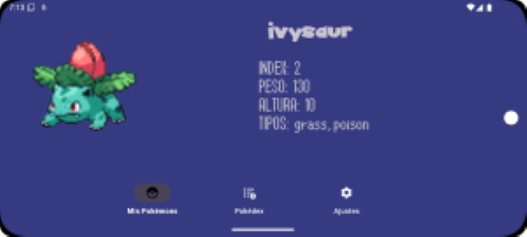

# Tarea3smr

## Introducción
Tarea3smr es una aplicación móvil que permite a los usuarios crear y gestionar una lista de Pokémon capturados. 
La aplicación cuenta con tres pestañas principales: Pokémon Capturados, Pokédex y Ajustes. 
Los usuarios pueden ver la lista completa de Pokémon en la Pokédex (obtenida directamente desde la API de pokémon) y agregar los que capturen a su lista personal. 
La aplicación utiliza Firebase para la autenticación y almacenamiento, y la API de Pokémon para obtener la lista inicial de Pokémon.

## Características principales
- **Autenticación**: Los usuarios pueden registrarse e iniciar sesión utilizando Firebase Authentication, con la opción de autenticarse mediante Google o correo electronico.
- **Pokédex**: Lista completa de Pokémon obtenidos de la API de Pokémon. Los usuarios pueden agregar Pokémon a su lista de capturados con un solo toque.
- **Pokémon Capturados**: Muestra una lista de los Pokémon capturados por el usuario, con detalles como nombre, foto, y tipo(s).
- **Ajustes**: Permite cambiar el idioma entre castellano e inglés, activar o desactivar la eliminación de Pokémon capturados, cerrar sesión y consultar información sobre el desarrollador.

## Tecnologías utilizadas
- **Firebase**: Utilizado para la autenticación y almacenamiento de datos.
- **Retrofit**: Utilizado para realizar las peticiones a la API de Pokémon.
- **Componentes**:
  - RecyclerView
  - Carview: ambos usados para mostrar las listas de Pokémons capturados y disponibles.
  - ViewBinding: para vincular las vistas de los archivos XML.
  - fragment: para implementar las distintas ventanas
  - constraintLayoud: para el diseño de la interfaz de usuario
  - NavHostFragment: para la navegacion entre los diferenctes fragmentos

## Instrucciones de uso
1. Clonar el repositorio:
    ```bash
    git clone https://github.com/tu-usuario/tu-repositorio.git
    ```
2. Abrir el proyecto en Android Studio.
3. Configurar Firebase en tu proyecto:
    - Crear un proyecto en [Firebase Console](https://console.firebase.google.com/).
    - Registrar la aplicación en Firebase y agregar el archivo `google-services.json` en el directorio `app`.
    - Habilitar Firebase Authentication y Firestore en Firebase Console.
4. Instalar las dependencias necesarias:
    - Asegúrate de tener configuradas las dependencias en el archivo `build.gradle`:
       ```gradle
       implementation 'com.google.firebase:firebase-bom:33.7.0'
       implementation 'com.google.firebase:firebase-firestore:25.1.1'
       implementation 'com.google.firebase:firebase-auth:23.1.0'
       implementation 'com.firebaseui:firebase-ui-auth:7.2.0'
       implementation 'com.squareup.retrofit2:retrofit:2.11.0'
       implementation 'com.squareup.retrofit2:converter-gson:2.11.0'
       implementation 'com.google.code.gson:gson:2.11.0'
       implementation 'com.github.bumptech.glide:glide:4.16.0'
       implementation 'com.squareup.picasso:picasso:2.8'
       implementation 'androidx.recyclerview:recyclerview:1.3.2'
       implementation 'androidx.cardview:cardview:1.0.0'
       implementation 'androidx.navigation:navigation-ui:2.8.5'
       implementation 'androidx.navigation:navigation-fragment:2.8.5'
       implementation 'com.google.android.material:material:1.4.0'
        ```

## Conclusiones del desarrollador
Desarrollar esta app ha sido todo un reto. Integrar Firebase para autenticación y almacenamiento, y utilizar Retrofit para consumir la API de Pokémon, no ha sido tan sencillo como esperaba.
Aún hay aspectos de estas tecnologías que no comprendo del todo, lo que hizo el proceso más complicado. Sin embargo, trabajar con tecnologías actualizadas como Firebase y Retrofit, en lugar de contenido desactualizado, ha sido muy gratificante. 

En cuanto a el uso de RecyclerView, CardView o SharedPreferences ya las habia usado en la anterior app y definitivamente practicar, practicar y practicar son la clave, he notado gran diferencia
a la hora de volverlas a aplicar en esta app, aunque noto que aún falta bastante me ha sido mucho más sencillo implementarlo todo.

En general, este proyecto me permitió profundizar en varias tecnologías actuales como Retrofit o Firebase creando una app que, aunque sea muy basica, permite comprobar la aplicabilidad de la teoria en un entorno real

## Capturas de pantalla

### Pantalla de Login


### Pantalla de Pokedéx


### Pantalla de Pokemons disponibles


### Pantalla de ajustes


### Pantalla de detalles del pokemon seleccionado


### Ejemplo pantalla en modo noche y posición horizontal



